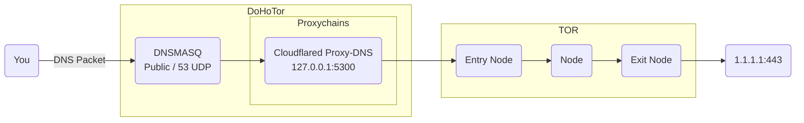

# DoHoTor: DNS over HTTPS over TOR!

This is an easily deployable docker service for running your personal DNS
server that resolves DNS queries using HTTPS (DoH) for __security__ and TOR for
__anonymity__.

With DoHoTor, your DNS traffic is no longer connected to you and your workstation!

DoHoTor is built upon

* dnsmasq,
* cloudflared,
* tor, and
* proxychains.

In practice, DoHoTor routes DNS traffic like this:



__Deployment__:

```bash
# Optionally fill `hosts` with additional host addresses
touch hosts
docker build -t dohotor ./
docker stack deploy --compose-file docker-stack.yml dohotor
```
